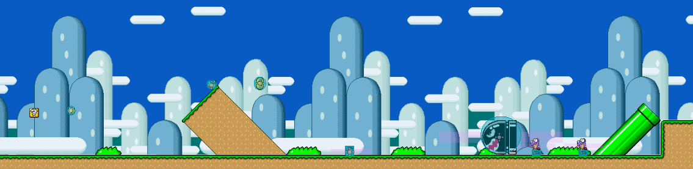
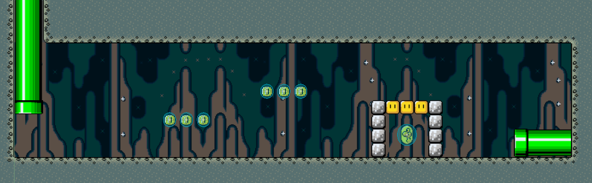
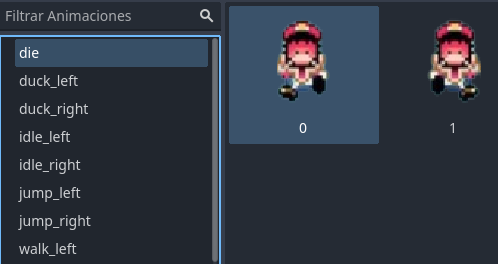
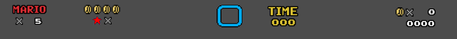

# Homenaje a Super Mario World - Nivel 1

Este proyecto es un homenaje al mítico **Super Mario World**, desarrollado en **Godot 4** por **Álvaro Quero** y **Marc Vidal**, dos alumnos del ciclo de Desarrollo de Aplicaciones Multiplataforma (DAM). Nuestro objetivo ha sido recrear el primer nivel del videojuego original desde cero, enfrentándonos a diversos desafíos técnicos y creativos.

---

## 🎮 Descripción del Proyecto

El juego incluye el **nivel 1** y su respectivo subnivel, junto con:
- **Efectos de sonido** que aportan inmersión.
- **Animaciones** cuidadas de personajes y objetos.
- **Programación intuitiva** para enemigos y jugadores.
- Adaptación de la resolución original (4:3) al formato moderno **16:9**.

---

## 🛠️ Retos Abordados

1. **Cambio de resolución**: Super Mario World fue diseñado en un formato 4:3. Adaptarlo a 16:9 implicó reimaginar la disposición del nivel sin perder la esencia del original.
2. **Inteligencia de enemigos**: Cada enemigo fue programado desde cero, replicando sus patrones de comportamiento con una lógica adaptada a Godot 4.
3. **Interactividad del jugador**: Se diseñó un sistema intuitivo de controles que respeta las dinámicas clásicas del juego.

---

## 🚀 Cómo Jugar

1. Descarga el ejecutable desde la sección de [Releases](#) en este repositorio.
2. Ejecuta el archivo en tu sistema.
3. ¡Disfruta recorriendo el Nivel 1 y recuerda la nostalgia del juego original!

---

## 🖼️ Recursos Visuales

Incluye estas imágenes en el repositorio para añadirlas al README:

1. **Captura del Nivel 1** 
   

2. **Vista del Subnivel** 
   

3. **Mario y enemigos animados**
   

4. **Interfaz de usuario (UI)**  
   

---

## 🤝 Colaboradores

Este proyecto fue realizado por:  
- **Marc Vidal**
- **Álvaro Quero**  

---

## 📜 Licencia

Este proyecto es un homenaje sin fines comerciales. Todos los derechos pertenecen a los creadores originales de Super Mario World y a Nintendo.
